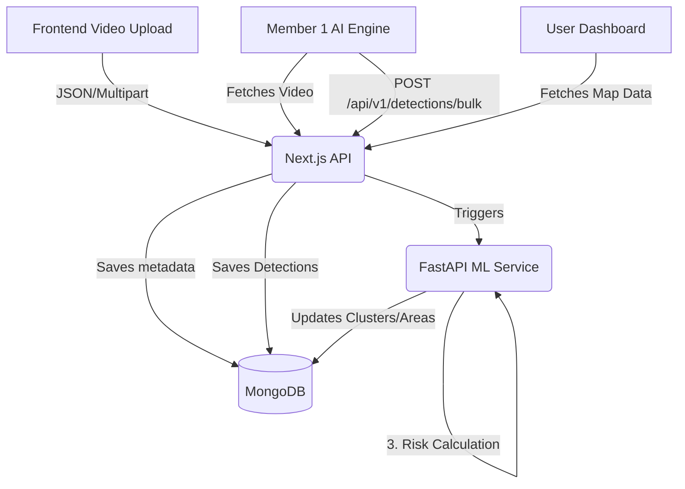

# SadakSurksha - Road Damage Detection & Risk Mapping System

SadakSurksha is a comprehensive Road Damage Detection and Risk Mapping platform designed to automatically identify, cluster, and evaluate road infrastructure damage (potholes, cracks, depressions) using a combination of AI Video Processing (YOLOv8), Satellite Imagery analysis, and algorithmic risk scoring.

The platform provides city planners and public works departments with a visual, data-driven dashboard to prioritize road repairs efficiently.

---

## 🚀 Features

- **Automated AI Detection Integration**: Supports ingesting bulk YOLOv8 detection data from video analyses (dashcams, drones).
- **Geospatial Clustering (DBSCAN)**: Automatically groups individual fault detections into localized "Clusters" for easier repair management.
- **Risk Assessment Engine**: Calculates a "Severity Score" and "Final Risk Score" by combining physical damage sizes with Satellite Aging Indexes (Sentinel-2 data).
- **Interactive Map Dashboard**: Visualize damage clusters, heatmaps, and road risk profiles using Leaflet/Mapbox integrations.
- **Analytics & Reporting**: Tracks monthly trends, priority rankings, and zone summaries.
- **Role-Based Access**: Admin, Operator, and Viewer roles with zone-based authority filtering.

---

## 🛠 Tech Stack

### Frontend (User Interface)
- **Framework**: Next.js 16 (App Router)
- **Language**: JavaScript/React
- **Styling**: Tailwind CSS
- **Maps**: Leaflet / React-Leaflet
- **Animations**: Framer Motion

### Backend & ML Service
- **API (Frontend BFF)**: Next.js API Routes (Node.js)
- **Database**: MongoDB (Geospatial `2dsphere` indexes)
- **ML Microservice**: FastAPI (Python)
- **ML/ Geospatial Tools**: scikit-learn (DBSCAN), Google Earth Engine API, Pandas.

---

## ⚙️ Architecture Workflow



---

## 💻 Local Development Setup

### Prerequisites
- Node.js (v18+)
- Python (v3.10+)
- MongoDB (running locally or MongoDB Atlas URI)

### 1. Database Setup
Ensure MongoDB is running locally on port `27017` or have a free Atlas URI ready.
The schemas expect `2dsphere` indexes on collections (`raw_detections`, `clusters`, `areas`, `roads`).

### 2. Frontend (Next.js)
```bash
cd frontend
npm install
```

Create a `.env.local` file in the `frontend/` directory:
```env
MONGODB_URI=mongodb://localhost:27017/road_damage_db
JWT_SECRET=your-super-secret-jwt-key
FASTAPI_URL=http://localhost:8000
```

Start the Next.js development server:
```bash
npm run dev
```
The frontend will be available at `http://localhost:3000`.

### 3. ML Service (FastAPI)
Open a new terminal session.
```bash
cd ml-service
python -m venv venv

# Windows
venv\Scripts\activate
# Mac/Linux
source venv/bin/activate

pip install -r requirements.txt
```

Create a `.env` file in the `ml-service/` directory:
```env
MONGODB_URI=mongodb://localhost:27017/road_damage_db
EE_SERVICE_ACCOUNT=path/to/your/gee-service-account.json
```

Start the FastAPI server:
```bash
uvicorn app.main:app --reload --port 8000
```
The ML API docs will be at `http://localhost:8000/docs`.

---

## 🌐 Production Readiness & Deployment

### Is the project production-ready?
The application is currently in a **robust Development/MVP state**. It perfectly serves as a highly functional demo, hackathon submission, or alpha release. 

To be considered strictly "Enterprise Production-Ready", future iterations should include:
- Dockerization (`Dockerfile` and `docker-compose.yml`) for containerized orchestration.
- Automated CI/CD pipelines (e.g., GitHub Actions).
- Cloud storage integration (AWS S3 / Cloudinary) instead of local `/public/uploads`.
- Granular error logging and monitoring (Sentry/Datadog).

### How to deploy for FREE?
You can easily deploy this stack using popular free-tier cloud providers perfectly suited for this architecture.

#### 1. Database: MongoDB Atlas
- Create a free account on [MongoDB Atlas](https://www.mongodb.com/cloud/atlas).
- Deploy an **M0 Free Cluster**.
- Add your deployment servers' IP addresses to the Network Access list (or allow `0.0.0.0/0` during testing).
- Copy the Connection String (URI) to use in your `.env` files.

#### 2. Frontend (Next.js): Vercel
- Create a free account on [Vercel](https://vercel.com/) and connect your GitHub repository.
- Select the `frontend` directory as your Root Directory.
- Vercel will automatically detect Next.js and apply the correct build settings (`npm run build`).
- **Crucial**: Add your Environment Variables (`MONGODB_URI`, `JWT_SECRET`, `FASTAPI_URL`) in the Vercel project settings before deploying.
- Click **Deploy**. Vercel provides a free `.vercel.app` domain with SSL.

#### 3. ML Backend (FastAPI): Render
- Create a free account on [Render](https://render.com/).
- Choose **New Web Service** and connect your GitHub repo.
- Set the Root Directory to `ml-service`.
- Environment: **Python 3**.
- Build Command: `pip install -r requirements.txt`.
- Start Command: `uvicorn app.main:app --host 0.0.0.0 --port $PORT`.
- Add your Environment Variables (`MONGODB_URI`, `EE_SERVICE_ACCOUNT` contents).
- Click **Create Web Service**. Note: Render's free tier spins down after inactivity, so the first request might take ~50 seconds to wake up (Cold Start).

*(Once the FastAPI service is deployed on Render, remember to update the `FASTAPI_URL` environment variable in your Vercel Next.js dashboard to point to the new Render URL instead of localhost!)*

---

## 🤝 Contributing & APIs
Please refer to the enclosed guides for detailed development information:
- `API_REFERENCE.md`
- `API_TESTING_GUIDE.md`
- `FRONTEND_IMPLEMENTATION_GUIDE.md`
- `ML_API_GUIDE.md`
